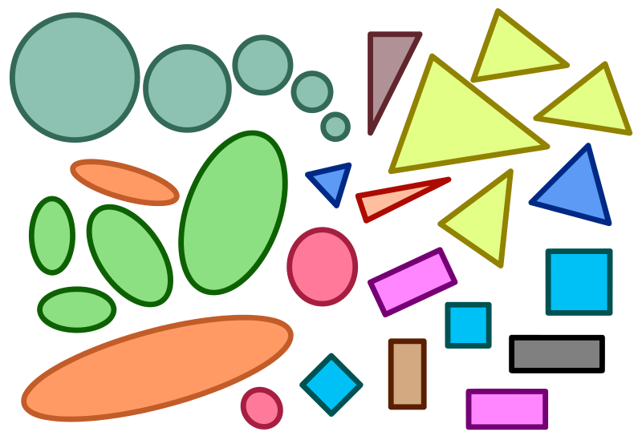

# Similarasm
.NET Duplicate Source Code Block Finder



" _Haven't I seen you before?  You look familiar to me..._ "

# Background
Detecting blatant copy-paste is relatively straightforward
eg [Duplo](https://github.com/TrevorDArcyEvans/duplo.git)
but simply renaming variables will defeat this algorithm.

This algorithm looks at the generated intermediate language (IL)
to detect duplication.

# Prerequisites
* .NET Core 6

# Getting started

```bash
$ git clone https://github.com/TrevorDArcyEvans/Similarasm.git
$ cd Similarasm
$ dotnet restore
$ dotnet build

# analyse a .NET solution
# Note that solution must currently build and have previously been built
$ ./Similarasm.UI.CLI/bin/Debug/net6.0/Similarasm.UI.CLI Similarasm.sln
```

# Discussion

## Performance
<details>

Analysing a solution is **really** slow because it has to:
* compile code
* reflect over generated assemblies
* search local nuget cache
* load assemblies from disk

All of these operations are slow :-(

</details>

## Limitations
The most important thing to realise is that this algorithm can only consider the
**complete** method.  As such, it cannot detect duplicate portions of code; it
can only detect completely duplicated methods.

### False positives
<details>

This generally happens for small methods, properties and trivial/default constructors.
These can probably be filtered out by only considering methods over a threshold number
of IL instructions.

</details>

### Source code opacity
<details>

Currently no real link between IL and corresponding source code.
However, in-memory compilation generates pdb's so it may be possible
to make a link.

</details>

### Renamed variables
<details>

These functions are a straight copy-paste with only the variable names changed.
They generate the same IL, so are detected as the same.

Note also that a discard does not appear to generate any IL.

```csharp
  public void Say(string message, int times)
  {
    Console.WriteLine(message);
    Double(times);
  }

  public void Greet(string greeting, int times)
  {
    Console.WriteLine(greeting);
    _ = Double(times);
  }
```

</details>

### Covariance + contravariance
<details>

Seems to detect duplication for return and parameter types

```csharp
  public IEnumerable<int> GetEnumerable(IEnumerable<int> original)
  {
    return new List<int>(original);
  }

  public List<int> GetList(List<int> original)
  {
    return new List<int>(original);
  }
```

</details>

### String interpolation
<details>

The second function uses string interpolation, so generates _different_ IL.
They are not considered the same, though should be.

It is not clear if JIT optimisations would result in the same machine code.
This is beyond the scope of this method.

```csharp

  public void Say(string message)
  {
    Console.WriteLine(message);
  }

  public void Greet(string greeting)
  {
    Console.WriteLine($"{greeting}");
  }
```

</details>

### Parameter reordering
<details>

Parameter reordering will avoid detection as they are now in a different
place on the stack.  Thus, the IL to get parameters will be different.

```csharp
  public void Say(string message, int times)
  {
    Console.WriteLine(message);
  }

  public void Greet(int times, string greeting)
  {
    Console.WriteLine(greeting);
  }
```

</details>

### Expresion body methods
<details>

Expression body methods avoid detection

```csharp
  public int Double(int number) => 2 * number;
  public int DoubleUp(int number)
  {
    return 2 * number;
  }
```

</details>

### Other scenarios
<details>

A **very** non-exhaustive list of other scenarios which are not detected:
* default parameter values
* probably lots of other refactorings and minor changes!

</details>

# Conclusions
At this stage, _Similarasm_ can only detect a very narrow range of
duplication (direct copy + variable rename).  By itself, it is of
marginal use but, combined with other algorithms ( eg _Duplo_ ),
it will improve overall duplicate detection.

# Further work
* only consider methods over a threshold number of IL instructions
* investigate using pdb's to link source code

# Acknowledgements
* image from [Wikipedia](https://commons.wikimedia.org/wiki/File:Similar-geometric-shapes.svg)

